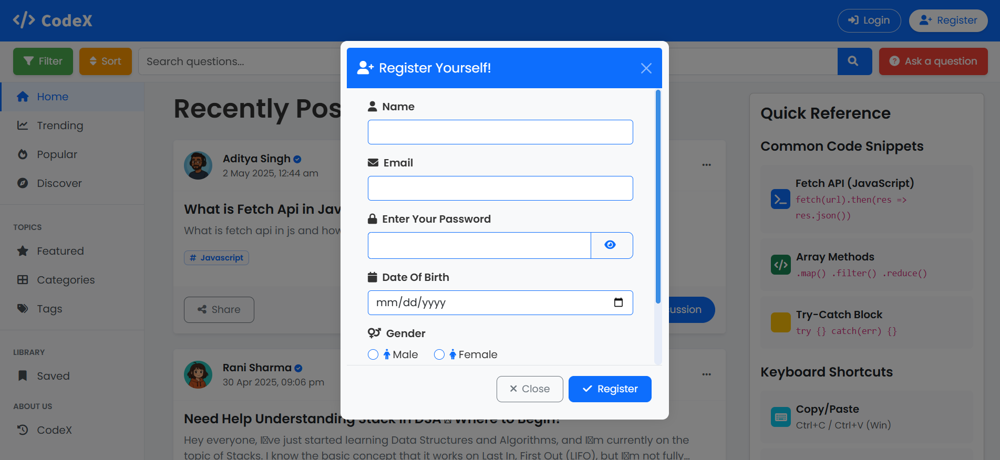
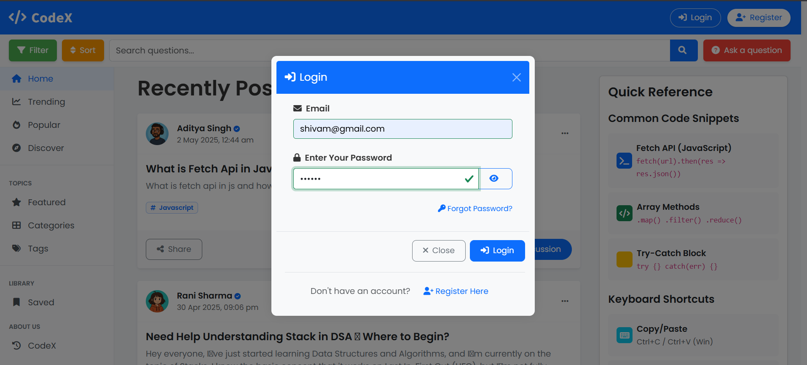
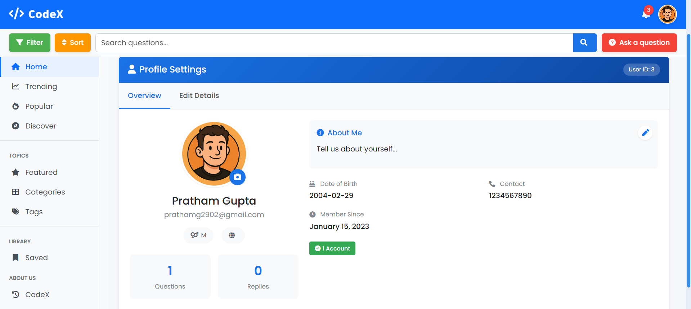
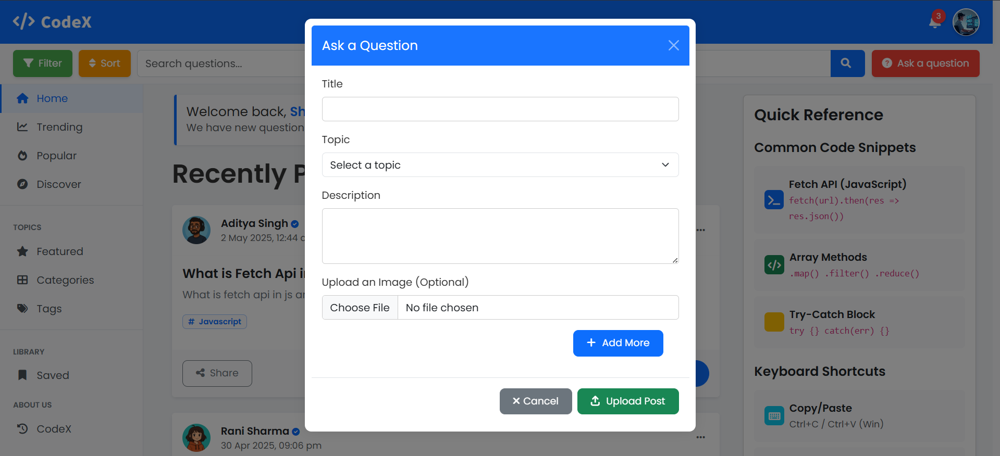
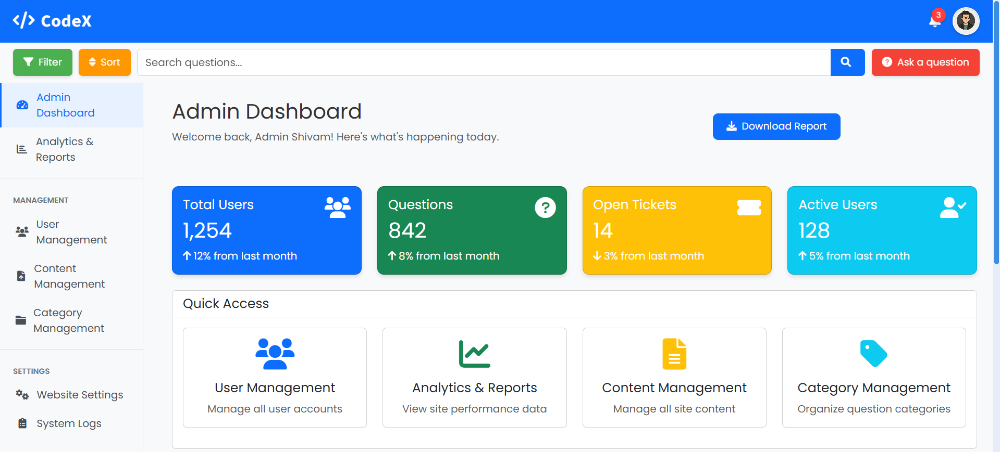
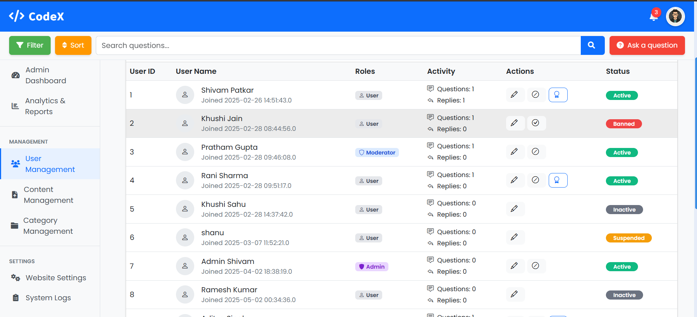
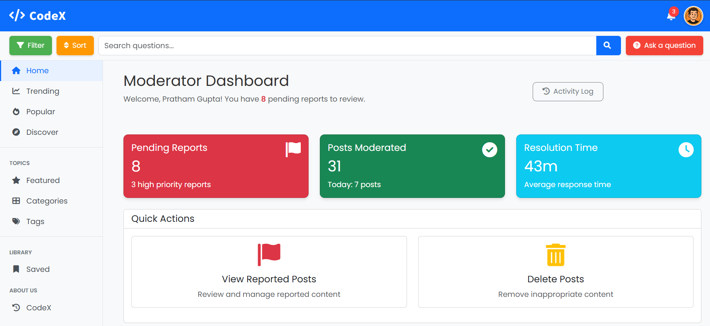
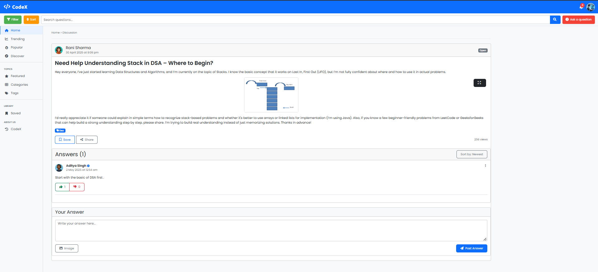

# 💬 CodeX – Technical Discussion Forum

**CodeX** is a full-stack web application built using **Core Java** and **Advanced Java** concepts like **Servlets**, **JSP**, and **JDBC**. It is designed to enable users to engage in structured technical discussions, promote knowledge sharing, and allow administrators to manage platform activity effectively.

This platform supports **role-based access control** (Admin, Moderator, User), making it ideal for educational institutions, tech communities, or corporate training environments where discussion quality and content moderation are important.

---


## 🔧 Tech Stack

### 🖥️ Frontend:
- HTML5, CSS3, JavaScript
- **Bootstrap** for responsive UI

### 🔙 Backend:
- Java
- **JSP & Servlets**
- **JDBC** for database connectivity

### 🗃️ Database:
- **MySQL**

### 🧰 Additional Tools:
- **JavaMail API** – for email notifications (e.g., moderator invites)
- **AJAX** – for dynamic and asynchronous interactions

---

## 🚀 Features

- **User Roles**:
  - 🛡️ Admin: Manages users, moderators, reports, and analytics
  - 🧑‍⚖️ Moderator: Handles reported content and maintains discussion quality
  - 👤 User: Can post questions, reply, and report inappropriate content

- 📊 **Admin Dashboard**: View reports, manage users/moderators, and track forum activity

- 🔔 **Email Integration**: Moderator invitation and confirmation via JavaMail API

- 📝 **Live Discussions**: Post questions and answers with AJAX-based interactions

- 🔒 **Authentication**: Secure login system with session handling

---

## 📸 Screenshots

### 🖼️ Homepage


### 🔐 Signup Page


### 🔑 Signin Page


### ✏️ Edit Profile


### 💬 Ask a Question


### 🛠️ Admin Dashboard



### 🛠️ Moderator Dashboard


### 💬 Discussion Thread


---


## 📦 Setup Instructions

1. **Clone the Repository**
   ```bash
   git clone https://github.com/shivampatkar/CodeX.git

2. Import into your IDE (e.g., Eclipse or IntelliJ)

3. Configure your MySQL database:
   - Import the `tdf.sql` file
   - Update DB credentials in your Java config

4. Deploy to Apache Tomcat

5. Visit: `http://localhost:8080/tdf`
